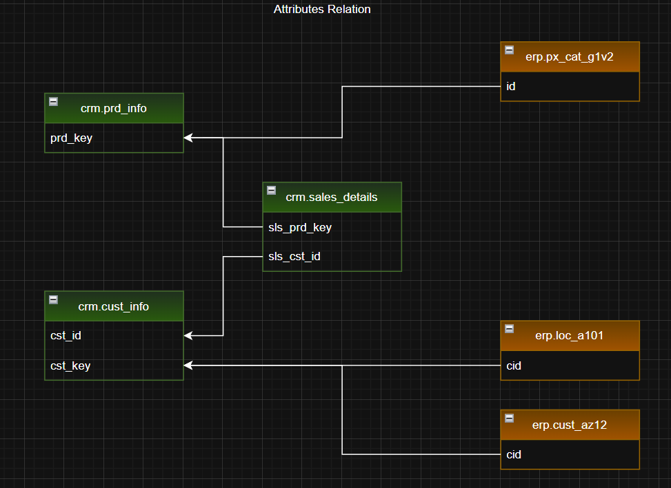
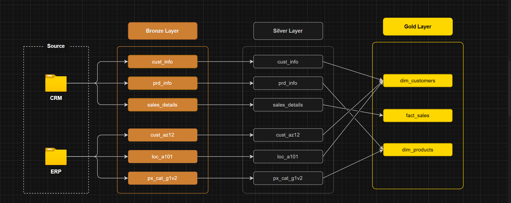
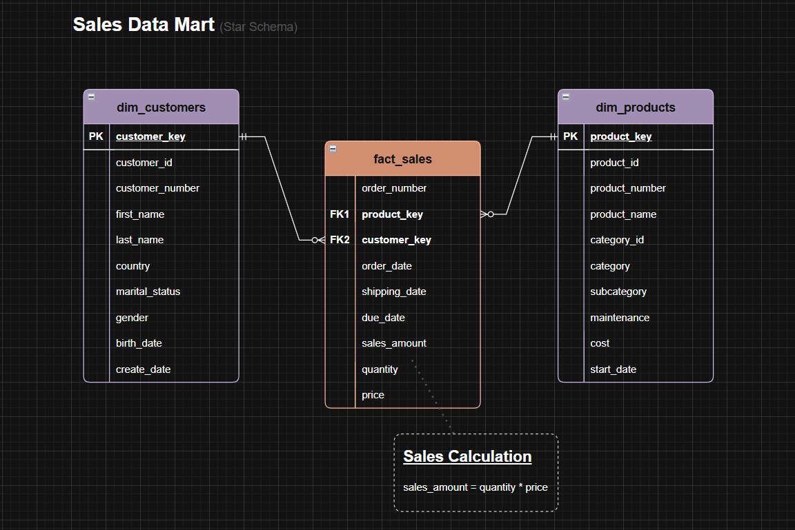

# 🏗️ Data Warehouse Project Structure 

This document provides a detailed overview of the project structure and flow, outlining the different layers of the Data Warehouse built using the **Medallion Architecture**. It covers the processes and components involved at each stage: **Bronze**, **Silver**, and **Gold**, and explains how data flows from raw ingestion to business-ready insights.

The goal of this document is to give a comprehensive understanding of how the project is organized and how data flows through each stage of the warehouse.

---

## 🗃️ Data Models

#### Entity - Relationship Diagram

#### Medallion Architecture

#### Star Schema Data Model

---

## 📂 Project Structure

##### 🟤 Bronze Layer (Raw Data Ingestion)

- Stores raw, unprocessed data from CRM and ERP systems.
- Data is ingested directly as received (may include duplicates, nulls, inconsistent formats).

##### ⚪ Silver Layer (Cleansed / Standardized Data)

- Contains cleaned, de-duplicated, and standardized data.
- Business rules applied: data quality checks, format standardization, referential integrity.

##### 🟡 Gold Layer (Business-Ready Data)

- Contains aggregated and business-ready tables for analytics and reporting.

---

## 📂 Next Steps

Now that you've seen the overall structure and flow of the project, feel free to explore the individual layers and their specific components. Each layer is detailed with the corresponding SQL scripts, sample datasets, and transformation logic to help you understand how data is ingested, cleansed, and prepared for analysis.

If you have any questions or need clarification, please refer to the [main README](../README.md) or open an issue in the repository.

---

## 🪪 License

This project is licensed under the MIT License.

---
